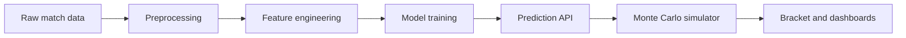

# FIFA World Cup 2026 Tournament Simulator

An end-to-end sports analytics project that predicts football match outcomes, runs Monte Carlo tournament simulations, and presents the results through an interactive Streamlit dashboard.

## Overview

This project combines historical football results, custom Elo ratings, feature engineering, and supervised machine learning to estimate match outcome probabilities. Those probabilities drive a full World Cup simulation engine capable of running 10,000+ tournaments and surfacing championship, semifinal, final, and elimination probabilities.

## Features

- Match prediction with three-way probabilities: home win, draw, away win
- Custom Elo rating system with save/load support
- Rolling team-strength features and match-context features
- Model comparison across logistic regression, random forest, XGBoost, and LightGBM
- Monte Carlo simulation for the full tournament
- Interactive bracket and Plotly dashboards
- Streamlit UI with multiple analysis pages

## Architecture



## Repository Structure

- `data/`: raw, processed, and external datasets
- `src/`: preprocessing, Elo, feature engineering, model training, prediction, simulation, bracket, and visualization code
- `app/`: Streamlit application
- `tests/`: unit tests
- `models/`: saved model artifacts

## Installation

```bash
pip install -r requirements.txt
```

## Usage

### Train the model

```bash
python -m src.train_model
```

### Launch the dashboard

```bash
streamlit run app/streamlit_app.py
```

### Run tests

```bash
pytest
```

## Data

The project is designed to work with the following inputs:

- International football results dataset from Kaggle
- FIFA rankings or Elo ratings
- Optional StatsBomb open data

If no local data files are present, the pipeline falls back to a realistic synthetic dataset so the project remains runnable end to end.

## ML Methodology

1. Clean and standardize historical match results
2. Build rolling team-strength features and context features
3. Train multiple multiclass classifiers
4. Select the best model using log loss and accuracy
5. Save the trained model and metadata with Joblib and JSON

## Deployment

### Local

Run the Streamlit app directly from your machine.

### Docker

Build a container with the included Dockerfile and run it on port 8501.

### Streamlit Cloud

Connect the repository and set the entry point to `app/streamlit_app.py`.

## Future Improvements

- Integrate live FIFA ranking APIs
- Replace heuristic goal estimation with a calibrated score model
- Add historical tournament-specific calibration
- Add FastAPI endpoints for programmatic access
- Persist simulation results to PostgreSQL
